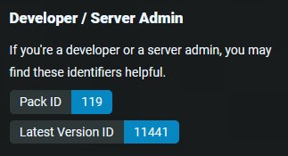

# What is this?
This is a script to pull minecraft mods from a set of API's given a manifest file.

### Why?
Because all the launchers break every other week and I can't be bothered to switch so I wrote my own script.

### Problem?
If you run into any issues whilst trying to use the script or just don't understand what you're doing, feel free to open an issue, I'm happy to help.

# Contents
- [How to use](#how-to-use)
    - [Prerequisites](#prerequisites)
    - [Initial setup](#initial-setup)
    - [Running the script](#running-the-script)
    - [Using the files](#using-the-downloaded-files)
- [Customization](#customization)
- [Automation](#automation)
- [Deprecations](#deprecations)

# How to use
## Prerequisites
- [Node.js](https://nodejs.org/en)

This project has been tested for Node 19.7.0. If you are experiencing any issues on other versions, please open an issue on [GitHub](https://github.com/newo-2001/MC-Modpack-Downloader) and I will see what I can do to support the version you are using.

## Initial setup
If this is your first time running the script you have to perform some additional setup:
1. Open a terminal in this folder and run the command `npm install`.

> [!IMPORTANT]
> The above step has to be repeated after pulling a new version of the script.
2. Copy the file `settings.example.json` and rename it to `settings.json`.
3. Acquire an API key from [the CurseForge website](https://console.curseforge.com/?#/api-keys) after logging in.

> [!IMPORTANT]
> The above step is still required, even if you don't intend on downloading from CurseForge. Other providers (modpacks.ch) might delegate the download to CurseForge behind the scenes.

4. Replace the `API_KEY_HERE` under the curseforge section with your api key in the `settings.json` file.

> [!NOTE]
> It might take several minutes for CurseForge to start accepting the API key after initial acquisition.

## Running the script
Before downloading a modpack, you need to figure out where you are downloading it from. Currently CurseForge and modpacks.ch (FTB) are supported. If you are sourcing your modpacks from a different provider, please let me know by opening a [GitHub issue](https://github.com/newo-2001/MC-Modpack-Downloader/issues), I will try to add support for it.

There are slight differences between the two:
- CurseForge uses a manifest file to identify a modpack, whereas modpacks.ch uses a pack id and version number
- For CurseForge this script only downloads the `.jar` files for the mods, as the other files are provided in the archive containing the `manifest.json` file, whereas for modpacks.ch, all of the files for the modpack are downloaded by the script.

If you've used the script before, make sure to clean out the output directory first. Specific instructions for your provider of choice follow below.

If you are downloading from CurseForge:
1. Download the archive for your modpack of choice from the [CurseForge website](https://www.curseforge.com/minecraft/search?class=modpacks).
2. Place the `manifest.json` file contained in the archive in the root directory of the project.

If you are downloading from modpacks.ch:
1. Locate the modpack id and version number on the [feed-the-beast website](https://www.feed-the-beast.com/). It looks like the image below:

    

Now regardless of the provider open a terminal in the root directory, run the command `npm start`, and follow the interactive prompt.

The script might come back saying some mods did not have a download url, this happens because mod authors can choose to disable API downloads on CurseForge to better monetize their work. If you get these messages, you will have to manually download these from somewhere (probably the [CurseForge website](https://www.curseforge.com/minecraft/).) When manually downloading, make sure the version number matches.

Refer to [Using the downloaded files](#using-the-downloaded-files), to install the modpack.

## Using the downloaded files
The downloaded files can be used with virtually any launcher that allows for creating custom profiles. These instructions are written for MultiMC, but similar steps should apply to whatever launcher you are using.

1. Create a new instance in MultiMC by clicking `Add Instance`.
2. Give it an appropriate name and select the correct minecraft version.
3. After the instance is created, click `Edit Instance` and navigate to the `Version` tab.
4. Press `Install Forge` (or Fabric if applicable), you probably want the recommended version.
5. Press the `Open .minecraft` button.
6. - If you downloaded the files from CurseForge you want to create a new directory called `mods` and drag the files downloaded by the script in here. You will also want to drag the rest of the files that came with the `.zip` besides `manifest.json` into this directory *next to the mods folder*.
   - If you downloaded with modpacks.ch you want to drag all the files downloaded by the script into this directory directly.

# Customization
The `settings.json` file provides several options to customize your experience.

### Logging
**LogFile** - The name of the file to log debug information to (default `latest.log`).
**LogLevel** - Determines how much information gets logged to the log file, valid values are `debug`, `info`, `warn`, and `error`. (default: `debug`)

### Downloads
**Concurrency** - This defines the amount of downloads that will happen at the same time. (default: `20`)

> [!WARNING]
> Changing the concurrency to a high value has the risk of downloads timing out due to exhausting system resources.

**Output Directory** - The directory in which the downloaded files will be placed. The output directory is relative to this directory. (default: `mods`)

### Curseforge
This section contains settings for the CurseForge mod provider, these **might** be used by other providers.

**Api Key** - CurseForge requires users of their api to provide an api key. You can get yours for free on [their website](https://console.curseforge.com/?#/api-keys) after logging in.

> [!CAUTION]
> Your API key is sensative information, you shouldn't post it online.

# Automation
In case you are writing an automated script this information might be of interest to you.

You can use one of the following commands to skip the provider selection prompt:
- `npm start curseforge` for CurseForge
- `npm start modpacks.ch` for modpacks.ch

# Deprecations
The following features are considered deprecated and might be removed in a future version.

| deprecated feature | alternative | deprecated since |
| --- | --- | --- |
| The npm scripts `npm run curseforge` and `npm run modpacks.ch` | Use the alternatives `npm start curseforge` and `npm start modpacks.ch` | v1.1.0 |
| The `modpacks.ch -> modpack` settings block in `settings.json` | Use the interactive prompt instead | v1.2.0 |
